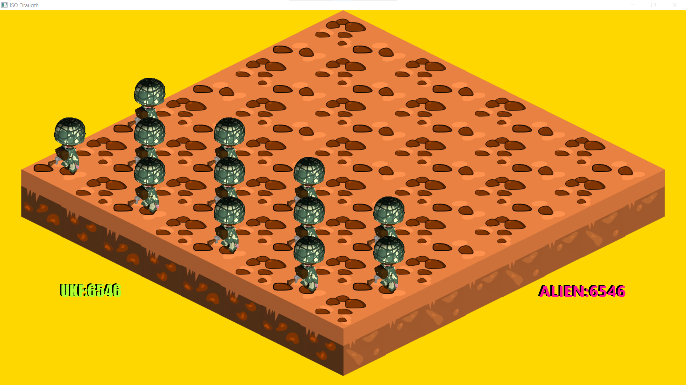

# The Walkingjelly checkers 
The Walkingjelly checkers is a isometric game made in Java , JavaFX . 
The grafic design created with Blender for characters , Gimp and Inkscape for scenario. 


- Install library, in the project folder launch the command:

``` 

mvn install:install-file -Dfile=./lib/checkersengine-1.0.jar -DgroupId=checkersengine -DartifactId=checkersengine -Dversion=1.0 -Dpackaging=jar 


```


- Run the game: 
```

mvn javafx:run


```



